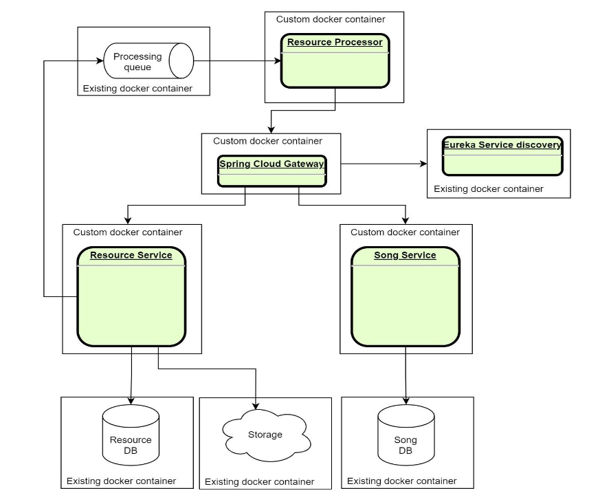

## Microservices overview
You need to implement the next three services.

### Resource service
This service will be used for data storing. Service should use some cloud-based storage or it’s emulation (for
example there is a S3 emulator - https://github.com/localstack/localstack).
Service should also track resources (with resource location) in underlying database

### Song Service
Service should provide managing capabilities for maintaining some metadata about songs (artist, album, etc).

### Resource processor
This service will be used to process MP3 source data.
This service will not have a web interface and will be used in future for data processing.
On current step, it should be basic spring boot app with MP3 parsing service implementation, able to extract
MP3 metadata for further storing of this data using songs metadata api

## Communication
- asynchronous communication via **messaging RabbitMQ Broker** between Resource Service and Resource Processor.
- synchronous communication via **OpenFeign** between Resource Processor and Song Service.
- **Spring Retry Template** for both synchronous and asynchronous communication.
