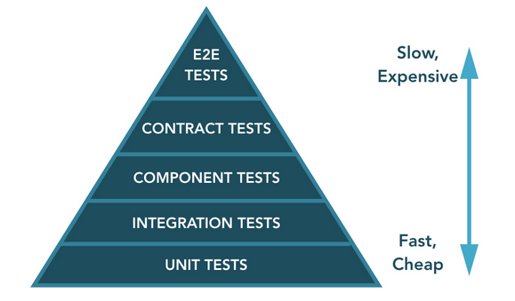

## Common microservice testing strategies

### Unit Testing
Exercise the smallest pieces of testable software in the application to determine whether they behave as expected.

### Integration testing
Verify the communication paths and interactions between components to detect interface defects.

### Component testing
Limit the scope of the exercised software to a portion of the system under test, manipulating the system through internal code interfaces and using test doubles to isolate the code under test from other components.

### Contract testing
Verify interactions at the boundary of an external service asserting that it meets the contract expected by a consuming service.

### End-to-end testing
Verify that a system meets external requirements and achieves its goals, testing the entire system, from end to end. 

## Test Ratio
The test pyramid helps us to maintain a balance between the different types of test.

In general, the more coarse grained a test is, the more brittle, time consuming to execute and difficult to write and maintain it becomes. 

Thus, testing approach might be 
- E2E - 5%
- Contract - 10%
- Component - 15%
- Integration - 25%
- Unit - 45%
